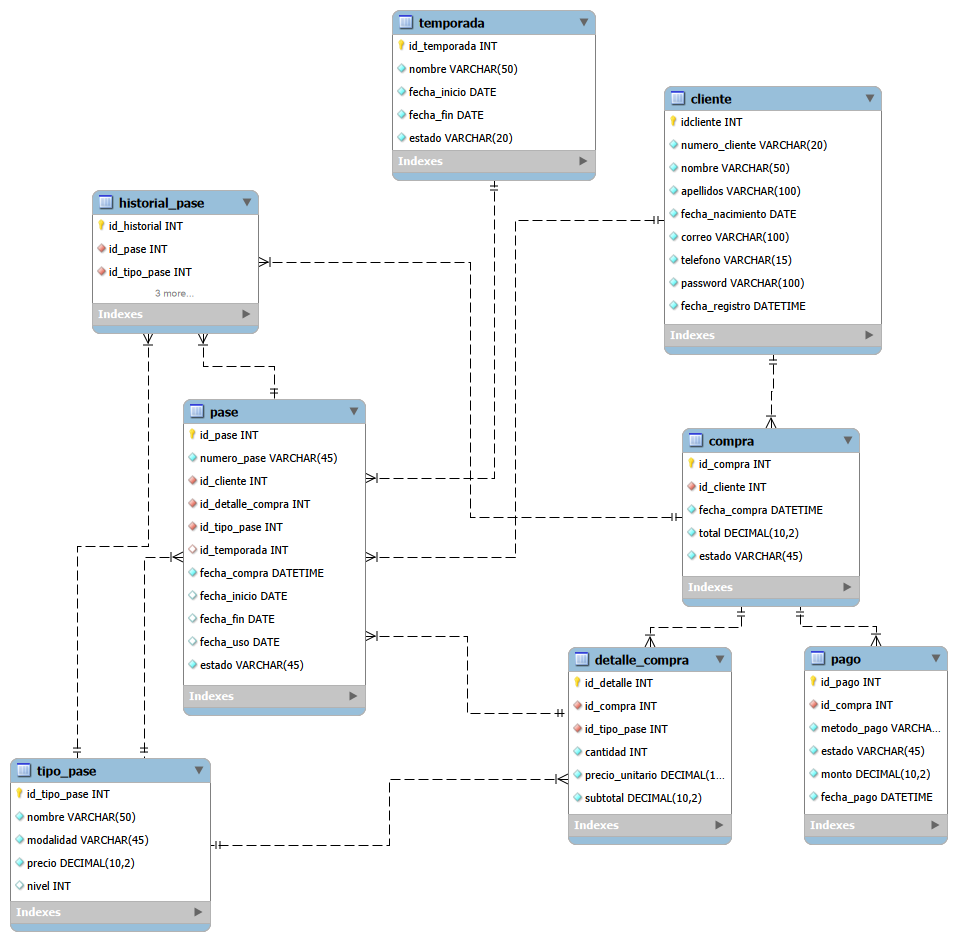

# Sistema de Gestión de Pases para Parque de Atracciones

## Descripción

Este proyecto consiste en el desarrollo de un sistema web para la gestión de clientes y pases de un parque de atracciones.

El sistema está diseñado para permitir el registro y administración de clientes, la compra de diferentes tipos de pases, el registro de pagos, la emisión y consulta de pases, así como el seguimiento del historial de actualización de los mismos. También contempla el manejo de temporadas y diferentes modalidades de pases, incluyendo pases anuales, pases de un día y pases complementarios.

La base de datos fue diseñada para organizar y relacionar la información necesaria para gestionar los procesos de clientes, compras, pagos y pases de manera estructurada.

## Diagrama Entidad-Relación

A continuación se muestra el Diagrama Entidad-Relación (DER) de la base de datos:



## Base de Datos

La base de datos utilizada para el proyecto se denomina `parque_atracciones` y está compuesta por las siguientes entidades:

* `cliente`
* `temporada`
* `tipo_pase`
* `compra`
* `detalle_compra`
* `pago`
* `pase`
* `historial_pase`

### Código SQL

```sql
-- MySQL Workbench Forward Engineering

SET @OLD_UNIQUE_CHECKS=@@UNIQUE_CHECKS, UNIQUE_CHECKS=0;
SET @OLD_FOREIGN_KEY_CHECKS=@@FOREIGN_KEY_CHECKS, FOREIGN_KEY_CHECKS=0;
SET @OLD_SQL_MODE=@@SQL_MODE, SQL_MODE='ONLY_FULL_GROUP_BY,STRICT_TRANS_TABLES,NO_ZERO_IN_DATE,NO_ZERO_DATE,ERROR_FOR_DIVISION_BY_ZERO,NO_ENGINE_SUBSTITUTION';

-- -----------------------------------------------------
-- Schema parque_atracciones
-- -----------------------------------------------------

-- -----------------------------------------------------
-- Schema parque_atracciones
-- -----------------------------------------------------
CREATE SCHEMA IF NOT EXISTS `parque_atracciones` DEFAULT CHARACTER SET utf8 ;
USE `parque_atracciones` ;

-- -----------------------------------------------------
-- Table `parque_atracciones`.`cliente`
-- -----------------------------------------------------
CREATE TABLE IF NOT EXISTS `parque_atracciones`.`cliente` (
  `idcliente` INT NOT NULL AUTO_INCREMENT,
  `numero_cliente` VARCHAR(20) NOT NULL,
  `nombre` VARCHAR(50) NOT NULL,
  `apellidos` VARCHAR(100) NOT NULL,
  `fecha_nacimiento` DATE NOT NULL,
  `correo` VARCHAR(255) NOT NULL,
  `telefono` VARCHAR(15) NOT NULL,
  `password` VARCHAR(255) NOT NULL,
  `fecha_registro` DATETIME NOT NULL,
  UNIQUE INDEX `numero_UNIQUE` (`numero_cliente` ASC) VISIBLE,
  UNIQUE INDEX `correo_UNIQUE` (`correo` ASC) VISIBLE,
  PRIMARY KEY (`idcliente`))
ENGINE = InnoDB;


-- -----------------------------------------------------
-- Table `parque_atracciones`.`temporada`
-- -----------------------------------------------------
CREATE TABLE IF NOT EXISTS `mydb`.`temporada` (
  `id_temporada` INT NOT NULL AUTO_INCREMENT,
  `nombre` VARCHAR(50) NOT NULL,
  `fecha_inicio` DATE NOT NULL,
  `fecha_fin` DATE NOT NULL,
  `estado` VARCHAR(20) NOT NULL,
  PRIMARY KEY (`id_temporada`))
ENGINE = InnoDB;


-- -----------------------------------------------------
-- Table `parque_atracciones`.`tipo_pase`
-- -----------------------------------------------------
CREATE TABLE IF NOT EXISTS `parque_atracciones`.`tipo_pase` (
  `id_tipo_pase` INT NOT NULL AUTO_INCREMENT,
  `nombre` VARCHAR(50) NOT NULL,
  `modalidad` VARCHAR(20) NOT NULL,
  `precio` DECIMAL(10,2) NOT NULL,
  `nivel` INT NULL,
  `categoria` VARCHAR(20) NOT NULL,
  PRIMARY KEY (`id_tipo_pase`))
ENGINE = InnoDB;


-- -----------------------------------------------------
-- Table `parque_atracciones`.`compra`
-- -----------------------------------------------------
CREATE TABLE IF NOT EXISTS `parque_atracciones`.`compra` (
  `id_compra` INT NOT NULL AUTO_INCREMENT,
  `id_cliente` INT NOT NULL,
  `fecha_compra` DATETIME NOT NULL,
  `total` DECIMAL(10,2) NOT NULL,
  `estado` VARCHAR(45) NOT NULL,
  PRIMARY KEY (`id_compra`),
  INDEX `id_cliente_idx` (`id_cliente` ASC) VISIBLE,
  CONSTRAINT `fk_compra_cliente`
    FOREIGN KEY (`id_cliente`)
    REFERENCES `mydb`.`cliente` (`idcliente`)
    ON DELETE NO ACTION
    ON UPDATE NO ACTION)
ENGINE = InnoDB;


-- -----------------------------------------------------
-- Table `parque_atracciones`.`detalle_compra`
-- -----------------------------------------------------
CREATE TABLE IF NOT EXISTS `parque_atracciones`.`detalle_compra` (
  `id_detalle` INT NOT NULL AUTO_INCREMENT,
  `id_compra` INT NOT NULL,
  `id_tipo_pase` INT NOT NULL,
  `cantidad` INT NOT NULL,
  `precio_unitario` DECIMAL(10,2) NOT NULL,
  `subtotal` DECIMAL(10,2) NOT NULL,
  PRIMARY KEY (`id_detalle`),
  INDEX `id_compra_idx` (`id_compra` ASC) VISIBLE,
  INDEX `id_tipo_pase_idx` (`id_tipo_pase` ASC) VISIBLE,
  CONSTRAINT `fk_detalle_compra_compra`
    FOREIGN KEY (`id_compra`)
    REFERENCES `mydb`.`compra` (`id_compra`)
    ON DELETE NO ACTION
    ON UPDATE NO ACTION,
  CONSTRAINT `fk_detalle_compra_tipo_pase`
    FOREIGN KEY (`id_tipo_pase`)
    REFERENCES `mydb`.`tipo_pase` (`id_tipo_pase`)
    ON DELETE NO ACTION
    ON UPDATE NO ACTION)
ENGINE = InnoDB;


-- -----------------------------------------------------
-- Table `parque_atracciones`.`pago`
-- -----------------------------------------------------
CREATE TABLE IF NOT EXISTS `parque_atracciones`.`pago` (
  `id_pago` INT NOT NULL AUTO_INCREMENT,
  `id_compra` INT NOT NULL,
  `metodo_pago` VARCHAR(45) NOT NULL,
  `estado` VARCHAR(45) NOT NULL,
  `monto` DECIMAL(10,2) NOT NULL,
  `fecha_pago` DATETIME NOT NULL,
  PRIMARY KEY (`id_pago`),
  UNIQUE INDEX `id_compra_UNIQUE` (`id_compra` ASC) VISIBLE,
  CONSTRAINT `fk_pago_compra`
    FOREIGN KEY (`id_compra`)
    REFERENCES `mydb`.`compra` (`id_compra`)
    ON DELETE NO ACTION
    ON UPDATE NO ACTION)
ENGINE = InnoDB;


-- -----------------------------------------------------
-- Table `parque_atracciones`.`pase`
-- -----------------------------------------------------
CREATE TABLE IF NOT EXISTS `parque_atracciones`.`pase` (
  `id_pase` INT NOT NULL AUTO_INCREMENT,
  `numero_pase` VARCHAR(45) NOT NULL,
  `id_cliente` INT NOT NULL,
  `id_detalle_compra` INT NOT NULL,
  `id_tipo_pase` INT NOT NULL,
  `id_temporada` INT NULL,
  `fecha_compra` DATETIME NOT NULL,
  `fecha_inicio` DATE NULL,
  `fecha_fin` DATE NULL,
  `fecha_uso` DATE NULL,
  `estado` VARCHAR(20) NOT NULL,
  PRIMARY KEY (`id_pase`),
  UNIQUE INDEX `numero_pase_UNIQUE` (`numero_pase` ASC) VISIBLE,
  INDEX `id_cliente_idx` (`id_cliente` ASC) VISIBLE,
  INDEX `id_detalle_compra_idx` (`id_detalle_compra` ASC) VISIBLE,
  INDEX `id_tipo_pase_idx` (`id_tipo_pase` ASC) VISIBLE,
  INDEX `id_temporada_idx` (`id_temporada` ASC) VISIBLE,
  CONSTRAINT `fk_pase_cliente`
    FOREIGN KEY (`id_cliente`)
    REFERENCES `mydb`.`cliente` (`idcliente`)
    ON DELETE NO ACTION
    ON UPDATE NO ACTION,
  CONSTRAINT `fk_pase_detalle_compra`
    FOREIGN KEY (`id_detalle_compra`)
    REFERENCES `mydb`.`detalle_compra` (`id_detalle`)
    ON DELETE NO ACTION
    ON UPDATE NO ACTION,
  CONSTRAINT `fk_pase_tipo_pase`
    FOREIGN KEY (`id_tipo_pase`)
    REFERENCES `mydb`.`tipo_pase` (`id_tipo_pase`)
    ON DELETE NO ACTION
    ON UPDATE NO ACTION,
  CONSTRAINT `fk_pase_temporada`
    FOREIGN KEY (`id_temporada`)
    REFERENCES `mydb`.`temporada` (`id_temporada`)
    ON DELETE NO ACTION
    ON UPDATE NO ACTION)
ENGINE = InnoDB;


-- -----------------------------------------------------
-- Table `parque_atracciones`.`historial_pase`
-- -----------------------------------------------------
CREATE TABLE IF NOT EXISTS `parque_atracciones`.`historial_pase` (
  `id_historial` INT NOT NULL AUTO_INCREMENT,
  `id_pase` INT NOT NULL,
  `id_tipo_pase` INT NOT NULL,
  `id_compra` INT NULL,
  `fecha` DATETIME NOT NULL,
  `tipo_movimiento` VARCHAR(20) NOT NULL,
  PRIMARY KEY (`id_historial`),
  INDEX `id_pase_idx` (`id_pase` ASC) VISIBLE,
  INDEX `id_tipo_pase_idx` (`id_tipo_pase` ASC) VISIBLE,
  INDEX `id_compra_idx` (`id_compra` ASC) VISIBLE,
  CONSTRAINT `fk_historial_pase_pase`
    FOREIGN KEY (`id_pase`)
    REFERENCES `mydb`.`pase` (`id_pase`)
    ON DELETE NO ACTION
    ON UPDATE NO ACTION,
  CONSTRAINT `fk_historial_pase_tipo_pase`
    FOREIGN KEY (`id_tipo_pase`)
    REFERENCES `mydb`.`tipo_pase` (`id_tipo_pase`)
    ON DELETE NO ACTION
    ON UPDATE NO ACTION,
  CONSTRAINT `fk_historial_pase_compra`
    FOREIGN KEY (`id_compra`)
    REFERENCES `mydb`.`compra` (`id_compra`)
    ON DELETE NO ACTION
    ON UPDATE NO ACTION)
ENGINE = InnoDB;


SET SQL_MODE=@OLD_SQL_MODE;
SET FOREIGN_KEY_CHECKS=@OLD_FOREIGN_KEY_CHECKS;
SET UNIQUE_CHECKS=@OLD_UNIQUE_CHECKS;
```
